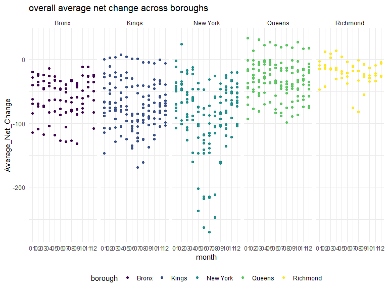

MT_project
================
Xiangxiong Feng
2023-10-23

    ## ── Attaching core tidyverse packages ──────────────────────── tidyverse 2.0.0 ──
    ## ✔ dplyr     1.1.3     ✔ readr     2.1.4
    ## ✔ forcats   1.0.0     ✔ stringr   1.5.0
    ## ✔ ggplot2   3.4.3     ✔ tibble    3.2.1
    ## ✔ lubridate 1.9.2     ✔ tidyr     1.3.0
    ## ✔ purrr     1.0.2     
    ## ── Conflicts ────────────────────────────────────────── tidyverse_conflicts() ──
    ## ✖ dplyr::filter() masks stats::filter()
    ## ✖ dplyr::lag()    masks stats::lag()
    ## ℹ Use the conflicted package (<http://conflicted.r-lib.org/>) to force all conflicts to become errors
    ## 
    ## 载入程辑包：'rvest'
    ## 
    ## 
    ## The following object is masked from 'package:readr':
    ## 
    ##     guess_encoding

\#Problem one

The two raw datasets include ‘USPS CHANGES OF ADDRESS NYC’ and ‘Zip
Codes’. The ‘USPS CHANGES OF ADDRESS NYC’ shows the aggregate Change of
Address (COA) data in New York City between 2018 and 2022. The data
includes 7variables such as zip code. There are total 11845
observations. The ‘Zip Codes’ is a supplementary dataset which has
important variables such as name of county and its neighborhood. There
are 8 variables and 324observation.

    ## # A tibble: 1 × 1
    ##       n
    ##   <int>
    ## 1   320

    ## # A tibble: 1 × 1
    ##       n
    ##   <int>
    ## 1    42

# 

| CITY                | Count |
|:--------------------|------:|
| JAMAICA             |   372 |
| FLUSHING            |   309 |
| ASTORIA             |   230 |
| QUEENS VILLAGE      |   165 |
| BAYSIDE             |   135 |
| LONG ISLAND CITY    |   120 |
| EAST ELMHURST       |   117 |
| OZONE PARK          |   116 |
| FRESH MEADOWS       |   107 |
| FAR ROCKAWAY        |   102 |
| LITTLE NECK         |    79 |
| RIDGEWOOD           |    70 |
| FLORAL PARK         |    68 |
| ELMHURST            |    63 |
| KEW GARDENS         |    62 |
| BELLEROSE           |    60 |
| BROOKLYN            |    60 |
| COLLEGE POINT       |    60 |
| CORONA              |    60 |
| HOWARD BEACH        |    60 |
| REGO PARK           |    60 |
| FOREST HILLS        |    59 |
| HOLLIS              |    59 |
| ROSEDALE            |    59 |
| WOODHAVEN           |    59 |
| WOODSIDE            |    59 |
| CAMBRIA HEIGHTS     |    58 |
| MASPETH             |    58 |
| MIDDLE VILLAGE      |    58 |
| SAINT ALBANS        |    57 |
| ARVERNE             |    56 |
| JACKSON HEIGHTS     |    56 |
| WHITESTONE          |    55 |
| RICHMOND HILL       |    54 |
| GLEN OAKS           |    52 |
| SUNNYSIDE           |    51 |
| ROCKAWAY BEACH      |    49 |
| SOUTH OZONE PARK    |    49 |
| BREEZY POINT        |    47 |
| SOUTH RICHMOND HILL |    47 |
| ROCKAWAY PARK       |    40 |
| DOUGLASTON          |    39 |
| OAKLAND GARDENS     |    38 |
| SPRINGFIELD GARDENS |    30 |
| LAURELTON           |    28 |
| LONG IS CITY        |    19 |
| BRIARWOOD           |    16 |
| NA                  |    16 |
| ROCKAWAY POINT      |    13 |
| BELLE HARBOR        |    11 |
| GLENDALE            |    11 |
| S RICHMOND HL       |     9 |
| QUEENS VLG          |     8 |
| S OZONE PARK        |     8 |
| BAYSIDE HILLS       |     6 |
| BROAD CHANNEL       |     5 |
| BEECHHURST          |     4 |
| KEW GARDENS HILLS   |     4 |
| NEPONSIT            |     4 |
| AUBURNDALE          |     2 |
| BELLEROSE MANOR     |     2 |
| SPRNGFLD GDNS       |     2 |
| CALVERTON           |     1 |
| CAMBRIA HTS         |     1 |
| JACKSON HTS         |     1 |
| MIDDLE VLG          |     1 |
| NEW YORK CITY       |     1 |
| ST ALBANS           |     1 |

| CITY             | Count |
|:-----------------|------:|
| NEW YORK         |  3477 |
| BRONX            |    60 |
| BROOKLYN         |    59 |
| NA               |    57 |
| CANAL STREET     |     4 |
| ROOSEVELT ISL    |     4 |
| ROOSEVELT ISLAND |     4 |
| BOWLING GREEN    |     1 |
| BROOKLYN HEIGHTS |     1 |
| NYC              |     1 |
| SECHEDATY        |     1 |
| WALL STREET      |     1 |

There are 60 months between 2018 and 2022. However, some of ZIP codes
have fewer 60 observations. The reason is that the records of some ZIP
codes for cerain months are missing in raw COA data. Moreover, most of
these are also missing neighborhood values, which are not given by the
origin Zip Codes data. For example, the records for ZIP code 10008 for
certain months are missing, and this ZIP cod has fewer 60 observations.
The neighborhood of this Zip code is also missing.

# problem 2

    ## `summarise()` has grouped output by 'borough'. You can override using the
    ## `.groups` argument.

| borough  | year | Average_net_change |
|:---------|:-----|-------------------:|
| Bronx    | 2018 |             -46.30 |
| Bronx    | 2019 |             -48.02 |
| Bronx    | 2020 |             -72.65 |
| Bronx    | 2021 |             -66.10 |
| Bronx    | 2022 |             -53.19 |
| Kings    | 2018 |             -46.18 |
| Kings    | 2019 |             -51.68 |
| Kings    | 2020 |            -110.67 |
| Kings    | 2021 |             -76.84 |
| Kings    | 2022 |             -55.38 |
| New York | 2018 |             -39.80 |
| New York | 2019 |             -52.54 |
| New York | 2020 |            -127.70 |
| New York | 2021 |             -39.47 |
| New York | 2022 |             -46.18 |
| Queens   | 2018 |             -25.71 |
| Queens   | 2019 |             -28.09 |
| Queens   | 2020 |             -46.55 |
| Queens   | 2021 |             -43.30 |
| Queens   | 2022 |             -29.28 |
| Richmond | 2018 |              -9.85 |
| Richmond | 2019 |              -9.12 |
| Richmond | 2020 |             -10.54 |
| Richmond | 2021 |             -22.55 |
| Richmond | 2022 |             -16.30 |

A table showing the average of `net_change` in each borough and year is
created. From this table, we can see that the overall average net change
keeps getting more negative from 2018 and reach an unusual peak around
2020, then it begins to return to normal level. The overall population
size is dercreasing.

| ZIPCODE | Neighborhood                  | year | month | net_change |
|--------:|:------------------------------|:-----|:------|-----------:|
|   10022 | Gramercy Park and Murray Hill | 2020 | 05    |       -983 |
|   10009 | Lower East Side               | 2020 | 07    |       -919 |
|   10016 | Gramercy Park and Murray Hill | 2020 | 06    |       -907 |
|   10016 | Gramercy Park and Murray Hill | 2020 | 07    |       -855 |
|   10009 | Lower East Side               | 2020 | 06    |       -804 |

The table above shows the five lowest values of net change. We can see
that all see that all these five observation are made in 2020, which is
corresponding to our last table. The neighborhood of three observation
are ‘Gramercy Park and Murray Hill’.

| ZIPCODE | Neighborhood        | year | month | net_change |
|--------:|:--------------------|:-----|:------|-----------:|
|   11101 | Northwest Queens    | 2018 | 04    |        360 |
|   11101 | Northwest Queens    | 2018 | 06    |        344 |
|   11101 | Northwest Queens    | 2018 | 05    |        300 |
|   10001 | Chelsea and Clinton | 2018 | 07    |        225 |
|   11201 | Northwest Brooklyn  | 2018 | 04    |        217 |

The table above shows the five highest values of net change across data
observed before 2020.

    ## `summarise()` has grouped output by 'borough', 'month'. You can override using
    ## the `.groups` argument.

    ## For information on available language packages for 'koRpus', run
    ## 
    ##   available.koRpus.lang()
    ## 
    ## and see ?install.koRpus.lang()

    ## 
    ## 载入程辑包：'koRpus'

    ## The following object is masked from 'package:readr':
    ## 
    ##     tokenize

| Method          | koRpus      | stringi       |
|:----------------|:------------|:--------------|
| Word count      | 274         | 261           |
| Character count | 1587        | 1587          |
| Sentence count  | 19          | Not available |
| Reading time    | 1.4 minutes | 1.3 minutes   |
